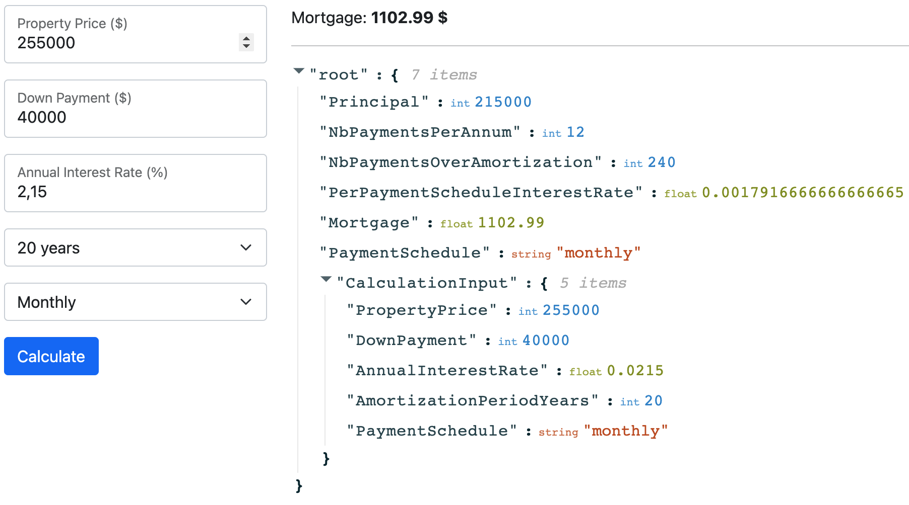

# Mortgage calculator



## How does it work?

The application has two parts:

* The calculation part which is built in Go. The source are in `pkg/core`.
* There are also two Go commands:
    * `cmd/wasm` which compiles a WebAssembly `ui/static/mortgage.wasm`, a calculation wrapper.
    * `cmd/ui` which is a static dir server which serves `ui/static`.
* The UI, which is a small React app. The build command creates the `ui/static/dist` dir. 

## Why using WebAssembly?

Because I know very well REST and I wanted to try WebAssembly with Go :)

It would be very easy, thanks to the `core` package, to create a new `server` package to create a REST wrapper for the calculator. But I found it funny to let the browser directly use the binary in this case.

## How to run it?

### Directly from the image export (faster)

```
curl -XGET https://brice-share.s3.ca-central-1.amazonaws.com/mortgage.tar > mortgage.tar \
    && docker load < mortgage.tar \
    && rm mortgage.tar \
    && docker run -it --rm -p 3000:3000 --name mortgage mortgage 
```

### By yourself using Docker

```
docker build -t mortgage . \
    && docker run -it --rm -p 3000:3000 --name mortgage mortgage
```

### If you want to run it locally...

Requirements:
* go `1.17`
* node `16`

```
git clone git@github.com:bcolucci/mortgage-calculator \
    && cd mortgage-calculator/ \
    && make
```

## How to test (core)

```
> make test
go test ./pkg/... -race -covermode=atomic -coverprofile=coverage.out
ok      github.com/bcolucci/mortgage-calculator/pkg/core        0.733s  coverage: 100.0% of statements
ok      github.com/bcolucci/mortgage-calculator/pkg/utils       0.318s  coverage: 100.0% of statements
```

## Cleanup Docker

    docker image rm mortgage